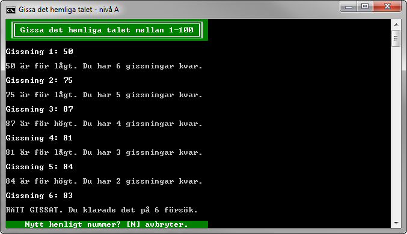
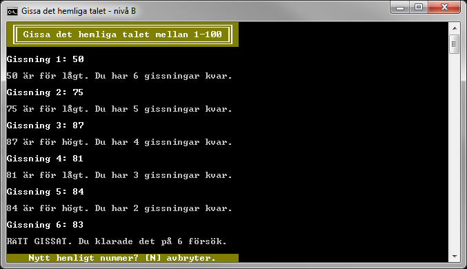

#Gissa det hemliga talet (A- och B-nivå)

> "Skriv färdigt en påbörjad konsolapplikation där användaren ska ha sju försök på sig att gissa ett hemligt tal i det slutna intervallet mellan 1 och 100."

I denna uppgift ska du slutföra ett påbörjat projekt med fördefinierad testfunktionalitet. En klass saknas, vilken du ska implementera på vald kravnivå A, B eller C, så att tester och koden i ```Main```-metoden i klassen ```Program``` fungerar enligt anvisningarna.

- [Uppgiftsbeskrivning på A-nivå:](a-level/)


Figur 1: Kravnivå A

- [Uppgiftsbeskrivning på B-nivå:](b-level/)


Figur 2: Kravnivå B

