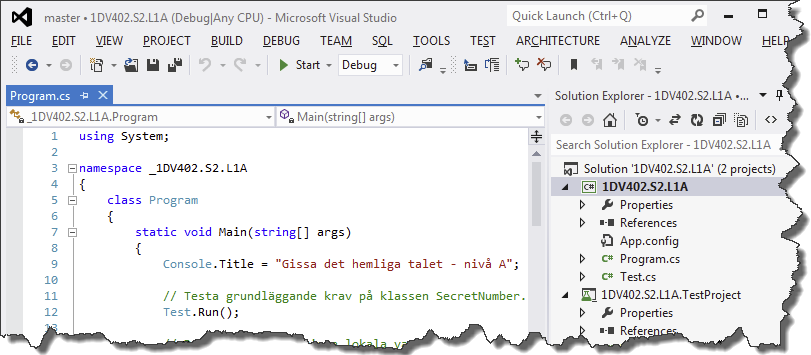
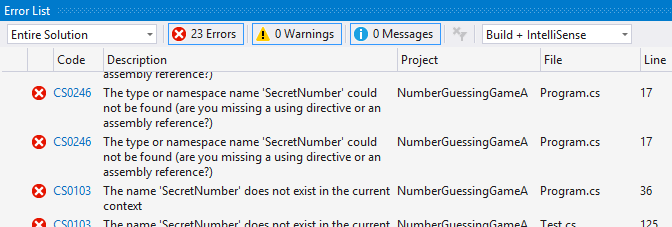
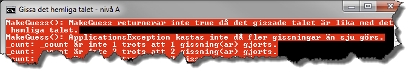
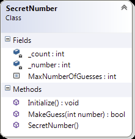
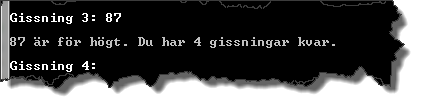
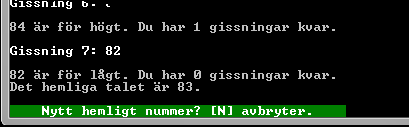

# Gissa det hemliga talet - nivå A

## Problem

Skriv färdigt en påbörjad konsolapplikation där användaren ska ha sju försök på sig att gissa ett hemligt tal i det slutna intervallet mellan 1 och 100. Börja med att hämta hem tillhörande projekt och komplettera därefter med klassen ```SecretNumber``` enligt klassdiagrammet i Figur A.5, så att tester och koden i ```Main```-metoden i klassen ```Program``` fungerar enligt anvisningarna.  


Figur A.1.

När en användare gjort en gissning ska resultatet av gissningen presenteras, det vill säga om gissningen var för låg, för hög eller rätt. Har användaren gissat rätt, eller förbrukat samtliga gissningar, ska det inte gå att göra fler gissningar innan ett nytt hemligt tal slumpats.

#####Det påbörjade projektet

Hämta hem projektet **NumberGuessingGameA** och öppna det i Visual Studio. Projektet innehåller bland annat de redan skrivna filerna ```Program.cs``` och ```Test.cs```. Denna källkod får på inget sätt modifieras. Koden i filerna har till uppgift att testa att klassen ```SecretNumber```, som ska definieras, uppfyller grundläggande krav på uppgiften.


Figur A.2.

Om du använder Visual Studio, som kan hantera det bifogade testprojektet, så kan du nu köra de tester som finns i testprojektet ```NumberGuessingGameA.TestProject``` genom att välja menykommandot **Test ► Run ► All Tests**. Innan klassen ```SecretNumber``` har lagts till projektet, och delvis implementerats, kommer källkoden dock inte att kunna kompileras.


Figur A.3. Felmeddelande då klassen SecretNumber lagts till men är ofullständigt implementerad.

Då klassen ```SecretNumber``` är implementerad så långt att den klarar att kompileras anropar metoden ```Main()``` (i klassen ```Program```), den statistiska metoden ```Run()``` i klassen ```Test```. Metoden ```Run()``` i sin tur anropar ett flertal privata statiska metoder som testar att grundläggande krav uppfylls av klassen ```SecretNumber```. Uppfylls inte alla krav meddelas detta i form av ett eller flera felmeddelande.


Figur A.4. Felmeddelanden då klassen SercetNumber inte är korrekt implementerad.

Först då klassen ```SecretNumber``` klarar samtliga tester utan fel kan det egentliga programmet starta och användaren kan börja gissa på heltal i det slutna intervallet mellan 1 och 100 (se Figur A.1).
			
#####Klassen SecretNumber

Klassen måste implementeras så att den som minst innehåller medlemmarna i klassdiagrammet i Figur A.5 och har den funktionalitet som beskrivs för respektive medlem för att klara samtliga tester.


Figur A.5. Klassdiagram över SecretNumber.

_Fältet_ __count_<br/>
Privat fält som räknar antalet gjorda gissningar sedan det hemliga talet slumpades fram.

_Fältet_ __number_<br/>
Privat fält som innehåller det hemliga talet.

_Konstanten MaxNumberOfGuesses_<br/>
Publik konstant med värdet 7 som definierar hur många gissningar en användare har på sig att gissa rätt.

_Metoden Initialize_<br/>
Publik metod som initierar klassens fält:

- __number_ ska tilldelas ett slumpat heltal i det slutna intervallet mellan 1 och 100.
- __count_ ska tilldelas värdet 0.

_Metoden MakeGuess_<br/>
Publik metod som anropas för att göra en gissning av det hemliga talet. Beroende på om det gissade talets värde, vilket hålls av parametern _number_, är för högt, lågt eller överensstämmer med det hemliga talet ska lämpliga meddelanden skrivas ut, innehållande det gissade värde samt antalet kvarstående gissningar.


Figur A.6. Exempel på meddelande efter gissning på ett för lågt värde.



Figur A.7. Exempel på meddelande efter gissning på ett för högt värde.


Figur A.8. Exempel på meddelande efter gissning på rätt hemligt tal.

Om den sjunde gissningen görs och är felaktig ska användaren meddelas att det inte är några gissningar kvar och vilket det hemliga talet var.



Figur A.9. Användaren misslyckas att gissa rätt hemligt tal på sju försök.

Anropas metoden ```MakeGuess()``` fler än sju gånger efter varandra innan ett nytt hemligt tal har slumpats fram, genom ett anrop av metoden ```Initialize()```, ska metoden ```MakeGuess()``` kasta ett undantag av typen ```ApplicationException```.

Om det vid anrop av metoden ```MakeGuess()``` skickas med ett argument som inte är i det slutna intervallet mellan 1 och 100 ska metoden, efter att ha undersökt parameterns värde, kasta ett undantag av typen ```ArgumentOutRangeException```.

_Konstruktorn_<br/>
Konstruktorn har till uppgift att se till att ett ```SecretNumber```-objekt är korrekt initierat. Det innebär att fälten har blivit tilldelade lämpliga värden, vilket enklast görs genom att låta konstruktorn anropa metoden ```Initialize()```.

## A-Krav

1. Koden i ```Program.cs``` och ```Test.cs``` måste exekveras och får inte ändras på något sätt.
2. Klassen ```SecretNumber``` ska vara publik och placerad i en egen fil med namnet ```SecretNumber.cs```.
3. Antalet gissningar som användaren har på sig att gissa rätt hemligt tal ska vara sju (7) och lagras i en publik namngiven konstant, med namnet ```MaxNumberOfGuesses``` i klassen ```SecretNumber```.
4. Antalet gissningar som gjorts sedan det hemliga talet slumpats fram ska lagras i det privata fältet ```_count``` i klassen ```SecretNumber```.
5. Det hemliga talet ska lagras i ett privat fält, ```_number```, i klassen ```SecretNumber```.
6. Konstruktorn i klassen ```SecretNumber``` måste säkerställa att ett objekt av klassen är korrekt initierat, dvs. att fälten har de värden som kan förväntas då ett nytt objekt instansierats och initierats. Speciellt viktigt är att fältet ```_number``` verkligen har ett värde i det slutna intervallet mellan 1 och 100 för att inte objektets status ska vara ogiltigt efter att konstruktorn exekverats.
7. Metoden ```Initialize()``` ska göra det möjligt att återställa ett objekt så att fälten ```_count``` och ```_number``` har lämpliga värden. Fältet ```_count``` ska ha värdet 0 och fältet ```_number``` ska ha ett slumpat värde i det slutna intervallet mellan 1 och 100.
8. Koden som slumpar fram det hemliga talet får bara förekomma en gång. (Bryt inte mot principen DRY (_Don’t Repeat Yourself_).
9. En gissning ska göras genom att metoden ```MakeGuess()``` i klassen ```SecretNumber``` anropas. Om användaren gissat rätt hemligt tal ska metoden returnera ```true``` annars ```false```. Metoden ska skriva ut ett lämpligt meddelande i konsolfönstret beroende på resultatet av gissningen, samt i övrigt definieras enligt givna instruktioner ovan.

## Tips

Läs om:

+ Klasser
	+ Essential C# 6.0, 217-228.
	+ https://msdn.microsoft.com/en-us/library/0b0thckt.aspx
+ Åtkomstmodifierare (”_Access Modifiers_”)
	+ Essential C# 6.0, 235-237.
	+ https://msdn.microsoft.com/en-us/library/ms173121.aspx
+ Konstruktorer
	+ Essential C# 6.0, 254-263.
	+ https://msdn.microsoft.com/en-us/library/k6sa6h87.aspx
+ Konstanter
	+ Essential C# 6.0, 277-278.
	+ https://msdn.microsoft.com/en-us/library/e6w8fe1b.aspx
+ Klassen Random
	+ https://msdn.microsoft.com/en-us/library/ts6se2ek.aspx

[Lösning](solution/)