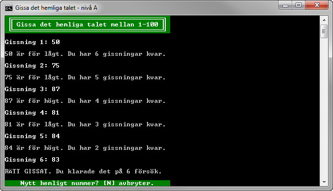

# Gissa det hemliga talet - nivå A

## Problem

Skriv färdigt en påbörjad konsolapplikation där användaren ska ha sju försök på sig att gissa ett hemligt tal i det slutna intervallet mellan 1 och 100. Börja med att hämta hem tillhörande projekt och komplettera därefter med klassen ```SecretNumber``` enligt klassdiagrammet i Figur A.5 så att tester och koden i ```Main```-metoden i klassen ```Program``` fungerar enligt anvisningarna.  


Figur A.1.

När en användare gjort en gissning ska resultatet av gissningen presenteras, det vill säga om gissningen var för låg, för hög eller rätt. Har användaren gissat rätt, eller förbrukat samtliga gissningar, ska det inte gå att göra fler gissningar innan ett nytt hemligt tal slumpats.

#####Det påbörjade projektet

Hämta hem filen projektet "NumberGuessingGameA" och öppna det i Visual Studio. Projektet innehåller bland annat de redan skrivna filerna ```Program.cs``` och ```Test.cs```. Denna källkod får på inget sätt får modifieras. Koden i filerna har till uppgift att testa att klassen ```SecretNumber```, som ska definieras, uppfyller grundläggande krav på uppgiften.


Figur A.2.

Om du använder Visual Studio, som kan hantera det bifogade testprojektet, så kan du nu köra de tester som finns i testprojektet ```NumberGuessingGameA.TestProject``` genom att välja menykommandot **Test ► Run ► All Tests**. Innan klassen ```SecretNumber``` har lagts till projektet, och delvis implementerats, kommer källkoden inte att kunna kompileras.


Figur A.3. Felmeddelande då klassen SecretNumber lagts till men är ofullständigt implementerad.

Då klassen ```SecretNumber``` är implementerad så långt att den klarar att kompileras anropar metoden ```Main()``` (i klassen ```Program```), den statistiska metoden ```Run()``` i klassen ```Test```. Metoden ```Run()``` i sin tur anropar ett flertal privata statiska metoder som testar att grundläggande krav uppfylls av klassen ```SecretNumber```. Uppfylls inte alla krav meddelas detta i form av ett eller flera felmeddelande.


Figur A.4. Felmeddelanden då klassen SercetNumber inte är korrekt implementerad.

Först då klassen ```SecretNumber``` klarar samtliga tester utan fel kan det egentliga programmet starta och användaren kan börja gissa på heltal i det slutna intervallet mellan 1 och 100 (se Figur A.1).
			
#####Klassen SecretNumber

**...**

## A-Krav

1. Koden i Program.cs och Test.cs måste exekveras och får inte ändras på något sätt.
**...**

## Tips

Läs om:

+ Klasser
	+ Essential C# 6.0, 217-228.
	+ https://msdn.microsoft.com/en-us/library/0b0thckt.aspx
+ Åtkomstmodifierare (”_Access Modifiers_”)
	+ Essential C# 6.0, 235-237.
	+ https://msdn.microsoft.com/en-us/library/ms173121.aspx
+ Konstruktorer
	+ Essential C# 6.0, 254-263.
	+ https://msdn.microsoft.com/en-us/library/k6sa6h87.aspx
+ Konstanter
	+ Essential C# 6.0, 277-278.
	+ https://msdn.microsoft.com/en-us/library/e6w8fe1b.aspx
+ Klassen Random
	+ https://msdn.microsoft.com/en-us/library/ts6se2ek.aspx

[Lösning](solution/)