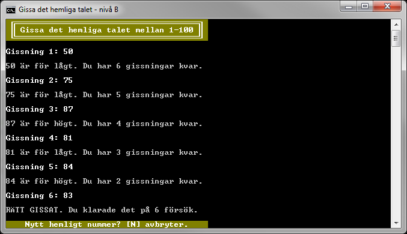
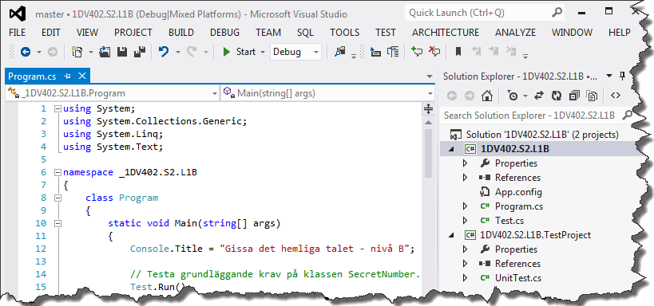
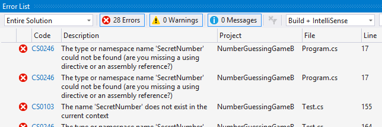
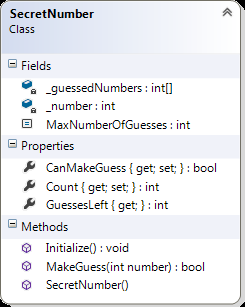
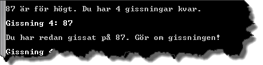
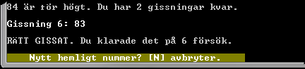
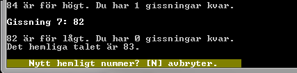

# Gissa det hemliga talet - nivå B

## Problem

Skriv färdigt en påbörjad konsolapplikation där användaren ska ha sju försök på sig att gissa ett hemligt tal i det slutna intervallet mellan 1 och 100. Börja med att hämta hem tillhörande projekt och komplettera därefter med klassen ```SecretNumber``` enligt klassdiagrammet i Figur B.5, så att tester och koden i ```Main```-metoden i klassen ```Program``` fungerar enligt anvisningarna.  


Figur B.1.

När en användare gjort en gissning ska resultatet av gissningen presenteras, det vill säga om gissningen var för låg, för hög eller rätt. Har användaren gissat rätt, eller förbrukat samtliga gissningar, ska det inte gå att göra fler gissningar innan ett nytt hemligt tal slumpats.

##### Det påbörjade projektet

Hämta hem projektet **NumberGuessingGameB** och öppna det i Visual Studio. Projektet innehåller bland annat filerna ```Program.cs``` och ```Test.cs```. Denna källkod får på inget sätt modifieras. Koden i filerna har till uppgift att testa att klassen ```SecretNumber```, som ska definieras, uppfyller grundläggande krav på uppgiften.


Figur B.2.

Använder du Visual Studio, som kan hantera det bifogade testprojektet, kan du köra de tester som finns i testprojektet ```NumberGuessingGameB.TestProject``` genom att välja menykommandot **Test ► Run ► All Tests**. Innan klassen ```SecretNumber``` har lagts till projektet, och delvis implementerats, kommer källkoden dock inte att kunna kompileras.


Figur B.3. Felmeddelande då klassen SecretNumber lagts till men är ofullständigt implementerad.

Då klassen ```SecretNumber``` är implementerad så långt att den klarar att kompileras anropar metoden ```Main()``` (i klassen ```Program```), den statistiska metoden ```Run()``` i klassen ```Test```. Metoden ```Run()``` i sin tur anropar ett flertal privata statiska metoder som testar att grundläggande krav uppfylls av klassen ```SecretNumber```. Uppfylls inte alla krav meddelas detta i form av ett eller flera felmeddelande.


Figur B.4. Felmeddelanden då klassen SercetNumber inte är korrekt implementerad.

Först då klassen ```SecretNumber``` klarar samtliga tester utan fel kan det egentliga programmet starta och användaren kan börja gissa på heltal i det slutna intervallet mellan 1 och 100 (se Figur B.1).
			
##### Klassen SecretNumber

Klassen måste implementeras så att den som minst innehåller medlemmarna i klassdiagrammet i Figur B.5 och har den funktionalitet som beskrivs för respektive medlem för att klara samtliga tester.


Figur B.5. Klassdiagram över SecretNumber. Observera att set-blocken för egenskaperna CanMakeGuess och Count är privata.

_Fältet_ __guessNumbers_<br/>
Privat fält av typen ```int[]```, som innehåller gjorda gissningar sedan det hemliga talet slumpats fram.

_Fältet_ __number_<br/>
Privat fält av typen ```int```, innehåller det hemliga talet.

_Konstanten MaxNumberOfGuesses_<br/>
Publik konstant, av typen ```int```, med värdet 7 som definierar hur många gissningar en användare har på sig att gissa rätt.

_Egenskapen CanMakeGuess_<br/>
Egenskap, av typen ```bool``` där ```get``` är publik och ```set``` är privat, som håller ordning på om användaren kan gissa eller inte. Så länge användaren kan göra en gissning ska egenskapen ha värdet ```true```. Egenskapen ska ha värdet ```false``` då en användare förbrukat sju gissningar eller lyckats gissa rätt.

_Egenskapen Count_<br/>
Egenskap, av typen ```int``` där ```get``` är publik och ```set``` är privat, som räknar antalet gjorda gissningar sedan det hemliga talet slumpades fram.

_Egenskapen GuessesLeft_<br/>
Publik ”read-only” egenskap, av typen ```int```, som ger hur många gissningar det återstår, dvs. differensen mellan maximalt antal tillåtna gissningar och antalet gjorda gissningar.

_Metoden Initialize_<br/>
Publik metod som initierar klassens fält och egenskaper:

- Arrayen som ```_guessedNumbers``` refererar till ska återanvändas och måste därför rensas på gjorda gissningar samt elementen initieras till standardvärdet för typen ```int```.
- ```_number``` ska tilldelas ett slumpat heltal i det slutna intervallet mellan 1 och 100.
- ```CanMakeGuess``` ska tilldelas värdet ```true```.
- ```Count``` ska tilldelas värdet 0.

_Metoden MakeGuess_<br/>
Publik metod som anropas för att göra en gissning av det hemliga talet. Beroende på om det gissade talets värde, vilket hålls av parametern _number_, är för högt, lågt eller överensstämmer med det hemliga talet ska lämpliga meddelanden skrivas ut, innehållande det gissade värde samt antalet kvarstående gissningar. En gissning på ett tidigare gissat tal ska inte räknas och användaren ska informeras om att det redan gjorts en gissning på det talet.


Figur B.6. Exempel på meddelande efter gissning på ett för lågt värde.


Figur B.7. Exempel på meddelande efter gissning på ett för högt värde.



Figur B.8. Exempel på meddelande efter gissning på ett tal, som är samma som en tidigare gjord gissning.



Figur B.9. Exempel på meddelande efter gissning på rätt hemligt tal.

Om den sjunde gissningen görs och är felaktig ska användaren meddelas att det inte är några gissningar kvar och vilket det hemliga talet var.



Figur B.10. Användaren misslyckas att gissa rätt hemligt tal på sju försök.

Anropas metoden ```MakeGuess()``` fler än sju gånger efter varandra innan ett nytt hemligt tal har slumpats fram, genom ett anrop av metoden ```Initialize()```, ska metoden ```MakeGuess()``` kasta ett undantag av typen ```ApplicationException```.

Om det vid anrop av metoden ```MakeGuess()``` skickas med ett argument som inte är i det slutna intervallet mellan 1 och 100 ska metoden, efter att ha undersökt parameterns värde, kasta ett undantag av typen ```ArgumentOutOfRangeException```.

_Konstruktorn_<br/>
Konstruktorn har till uppgift att se till att ett ```SecretNumber```-objekt är korrekt initierat. Det innebär att fält och egenskaper har blivit tilldelade lämpliga värden, vilket enklast görs genom att låta konstruktorn anropa metoden ```Initialize()```. Konstruktorn ska även ansvara för att instansiera arrayen som håller ordning på gjorda gissningar.

## B-Krav

1. Koden i ```Program.cs``` och ```Test.cs``` måste exekveras och får inte ändras på något sätt.
2. Klassen ```SecretNumber``` ska vara publik och placerad i en egen fil med namnet ```SecretNumber.cs```.
3. Antalet gissningar som användaren har på sig att gissa rätt hemligt tal ska vara sju (7) och lagras i en publik namngiven konstant, med namnet ```MaxNumberOfGuesses```.
4. De gissningar som gjorts sedan det hemliga talet slumpats fram ska lagras i det privata fältet ```_guessedNumbers```. Fältet ska referera till en array med heltal och endast ett objekt av typen ```int[]``` får instansieras per instans av ```SecretNumber```-objekt.
5. Det hemliga talet ska lagras i det privata fältet ```_number```.
6. Ett ```SecretNumber```-objekt ska via egenskapen ```CanMakeGuess``` hålla ordning på om det är tillåtet/meningsfullt att gissa, dvs. anropa metoden ```MakeGuess()```, eller inte.
7. Antalet gissningar som gjorts sedan det hemliga talet slumpats fram ska lagras i egenskapen ```Count```, där ```get```-metoden ska vara publik och ```set```-metoden privat.
8. Egenskapen ```GuessesLeft``` ska ge kvarstående antal gissningar.
9. Konstruktorn i klassen ```SecretNumber``` måste säkerställa att ett objekt av klassen är korrekt initierat, dvs. att fälten och egenskaperna har de värden som kan förväntas då ett nytt objekt instansierats och initierats. Speciellt viktigt är att fältet ```_number``` verkligen har ett värde i det slutna intervallet mellan 1 och 100 för att inte objektets status ska vara ogiltigt efter att konstruktorn exekverats.
10. Metoden ```Initialize()``` ska göra det möjligt att återställa ett objekt så att fält och egenskaper har lämpliga värden för att en ny gissningsomgång ska kunna göras utan ett nytt ```SecretNumber```-objekt behöver instansieras.
11. Koden som slumpar fram det hemliga talet får bara förekomma en gång. (Bryt inte mot principen DRY (_Don’t Repeat Yourself_).
12. En gissning ska göras genom att metoden ```MakeGuess()``` i klassen ```SecretNumber``` anropas. Om användaren gissat rätt hemligt tal ska metoden returnera ```true``` annars ```false```. Metoden ska skriva ut ett lämpligt meddelande i konsolfönstret beroende på resultatet av gissningen, samt i övrigt definieras enligt givna instruktioner ovan.

## Tips

Läs om:

+ Klasser
	+ Essential C# 6.0, 217-228.
	+ https://msdn.microsoft.com/en-us/library/0b0thckt.aspx
+ Åtkomstmodifierare (”_Access Modifiers_”)
	+ Essential C# 6.0, 235-237.
	+ https://msdn.microsoft.com/en-us/library/ms173121.aspx
+ Konstruktorer
	+ Essential C# 6.0, 254-263.
	+ https://msdn.microsoft.com/en-us/library/k6sa6h87.aspx
+ Egenskaper
	+ Essential C# 6.0, 237-244.
	+ https://msdn.microsoft.com/en-us/library/x9fsa0sw.aspx.
+ Konstanter
	+ Essential C# 6.0, 277-278.
	+ https://msdn.microsoft.com/en-us/library/e6w8fe1b.aspx
+ Klassen Random
	+ https://msdn.microsoft.com/en-us/library/ts6se2ek.aspx

[Lösning](solution/)